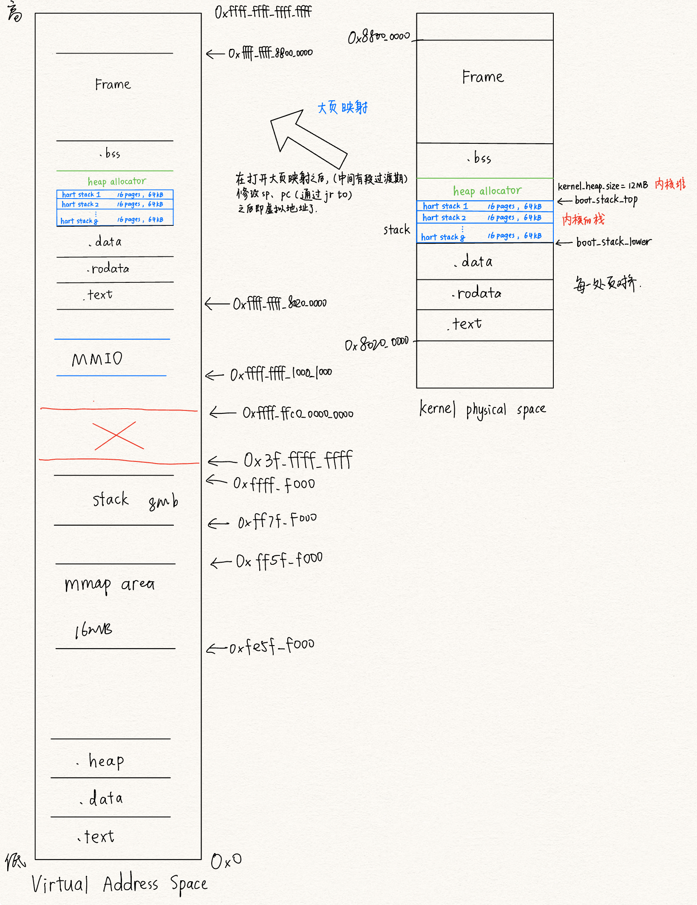

### 1. 概述

在`duckos`中，对于地址空间有两种选择，一种是内核和用户程序共享地址空间，另外一种是内核和用户程序地址空间分开。基于方便的考虑，我们采取第一种方案，虽然这种方式可能会降低地址空间的安全性，但是在实现这个操作系统时，我们的首要考虑是实现复杂度低。对于内核地址空间，我们采取了直接映射的方法；而对于用户的地址空间，我们采取物理页帧随机映射。同时，对于每个用户程序而言，在初始化的时候，需要将内核的地址空间映射到用户程序的页表中。

### 2. 地址处理和页表

这里我们参考了`rcore`中的设计思想，在其基础上，只做了轻微的调整。

```rust
pub type VirtAddr = usize;
pub type PhysAddr = usize;
```

为了方便，实现物理和逻辑地址时，我们并没有使用`RAII`的思想，而是直接使用`usize`类型管理。所以在之后的虚拟地址和物理地址变换中，先检查了虚拟地址和物理地址的合法性。

```rust
pub fn check_kernel_va(vaddr: VirtAddr) {
    assert!((VADDR_LOW <= vaddr && vaddr <= VADDR_HIGH) || 
        (VIRTIO0 <= vaddr && vaddr <= VIRTIO0 + 0x4000));
}

pub fn check_user_va(vaddr: VirtAddr) {
    assert!((VADDR_LOW <= vaddr && vaddr <= VADDR_HIGH) || 
    (VIRTIO0 <= vaddr && vaddr <= VIRTIO0 + 0x4000) ||
    ((LOW_LIMIT <= vaddr && vaddr <= USER_UPPER_LIMIT))
    );
}
```

页表则是参考了`rcore`的实现，在此基础上完善了部分的功能。

### 3.  虚拟地址（逻辑段）和物理地址空间

这部分的设计参考了`Titanix`，将物理地址空间抽象出来，方便管理。

1. 物理地址空间

   考虑到物理地址空间对`page`的管理和`mmap`系统调用中可能使用到的映射文件`backen_file`，我们将这个部分抽象出来，从而可以更加方便的管理这两部分的数据结构，让整个的结构更加清晰，耦合度更低。同时，该部分还实现了地址空间变换的函数`（例如：split）`，为后续实现`mmap, mprotect munmap`系统调用做了一个基础。

   ```rust
   pub struct PhysMemoryAddr {
       // (key: vpn, value: page)
       pub page_manager: BTreeMap<usize, Arc<Page>>,
       // mmap时，物理内存对应磁盘上的文件
       pub backen_file: Option<BackenFile>,
   }
   ```

2. 逻辑段

   抽象处于连续地址空间的一段虚拟地址空间，并将其称为逻辑段，而多个逻辑段组合成了整个的虚拟地址空间。每个逻辑段管理了其对应的物理地址空间和虚拟地址空间范围。

   ````rust
   pub struct VirtMemoryAddr {
       pub pma: SyncUnsafeCell<PhysMemoryAddr>,
       pub start_vaddr: VirtAddr,
       pub end_vaddr: VirtAddr,
   
       pub map_permission: MapPermission,
       pub vma_type: VmaType,
       pub map_type: MapType,
       pub page_fault_handler: Option<Arc<dyn PageFaultHandler>>,
   }
   ````

### 4. 中间层——`VmaRange`

出于对后续实现`mmap, mprotect munmap`系统调用时对于地址空间范围大小变化的需求，我们借鉴了`maturin`中的部分思想。“计算机科学领域的任何问题，都可以通过增加一个间接的中间层来解决”。秉承着这个思想，我们添加了一个可以自由实现地址空间大小的中间层。

```rust
pub struct VmaRange {
    pub segments: BTreeMap<usize, VirtMemoryAddr>,
}
pub fn unmap_if_overlap(&mut self, start: usize, end: usize, pt: &mut PageTable) -> UnmapOverlap {
        let start = align_down(start);
        let end = align_up(end);
        if !self.is_overlap(start, end) {
            UnmapOverlap::Unchange
        } else if start <= self.start_vaddr {
            if end < self.end_vaddr {
                // 左边相交
                let right_vma = self.split(end);
                self.remove(pt);
                *self = right_vma;
                UnmapOverlap::Shrink
            } else {
                // 包括了原有的区间
                self.remove(pt);
                UnmapOverlap::Removed
            }
        } else if end < self.end_vaddr {
            // 被原有的区间包括了
            let right_vma = self.split(end);
            self.split(start).remove(pt);
            UnmapOverlap::Split(right_vma)
        } else {
            // 右边有相交
            self.split(start).remove(pt);
            UnmapOverlap::Shrink
        }
    }
```

在这段代码的例子中，我们通过下一层`VirtMemoryAddr`提供的区间变化服务，在这一层中采取线段树的形式，管理不同地址空间的大小。

### 5. 地址空间

作为一个进程所占用的内存地址空间。在初始化过程时，需要完成不同`VmaRange`的映射

```rust
pub struct MemorySet {
    pub areas: VmaRange,
    pub pt: SyncUnsafeCell<PageTable>,
    pub heap_end: usize,
    pub cow_manager: CowManager,
}
```

### 6. 整个地址空间布局



