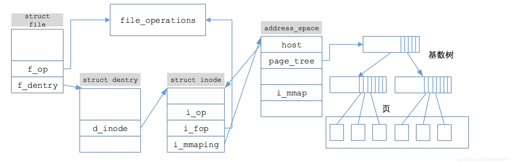

### 1. 概述
对于文件系统，我们的主要目标是让整个的模块结构清晰合理，耦合性低，符合大赛的要求，同时具有良好的可拓展性。因此，我们参考`Linux`的设计思想，采取虚拟文件系统层 + 各种文件系统的具体实现的策略。
### 2. 虚拟文件系统
该模块借鉴了`Linux`中VFS的设计，让`duckos`可以支持多种文件系统。我们为不同的文件系统设置了统一的接口。
整个文件系统被抽象为`File, Dentry, Inode和filesystem`四个部分。同时利用`rust`的语言特性，使用`Trait`完成每个抽象的对象。从而不同的文件系统只需要实现这个特征即可。

1. *Dentry* 部分
    这个部分处理目录文件名的查找。引入`dentry`的目的在与降低通过文件名或者目录名查找相关文件实体所花费的时间。
```rust
pub trait Dentry: Sync + Send + Any {
    fn metadata(&self) -> &DentryMeta;
    fn load_child(&self, this: Arc<dyn Dentry>);
    fn load_all_child(&self, this: Arc<dyn Dentry>);
    fn open(&self, dentry: Arc<dyn Dentry>, flags: OpenFlags) -> OSResult<Arc<dyn File>>;
    fn create(&self, this: Arc<dyn Dentry>, name: &str, mode: InodeMode) -> OSResult<Arc<dyn Dentry>>;
    fn mkdir(&self, path: &str, mode: InodeMode) -> Arc<dyn Dentry>;
    fn mknod(&self, path: &str, mode: InodeMode, dev_id: Option<usize>) -> Arc<dyn Dentry>;
    fn unlink(&self, child: Arc<dyn Dentry>);
    fn list_child(&self) {
        let meta_inner = self.metadata().inner.lock();
        println!("cwd: {} --", meta_inner.d_path);
        for (name, _child) in meta_inner.d_child.iter() {
            println!("       |-> {}", name);
        }
    }
}
```
2. *Inode*部分

   这个部分是文件在磁盘上（如果有）的实体表示。一切对于文件的读和写最终都是通过`inode`来操作，而不同的文件系统需要实现`inode`中提供的接口，也即在磁盘上读写的方式。同时，`inode`还负责管理不同文件的属性信息。

```rust
pub trait Inode: Sync + Send {
    fn metadata(&self) -> &InodeMeta;
    fn delete_data(&self);
    fn read(&self, offset: usize, buf: &mut [u8]);
    fn write(&self, offset: usize, buf: &mut [u8]);
    fn read_all(&self) -> Vec<u8>;
}
```

3. *File* 部分

   该部分抽象的是内存中的文件。与磁盘上的文件不同的是，内存中文件数据的读写都是在`page_cache`上，这样做的目的是利用时间局部性原理，并且减少访问磁盘的次数，从而降低时间开销。同时，内存中的文件支持`truncate`（修改文件大小）和`seek`（实现文件的随机读写）等操作，相比于磁盘上的文件，抽象程度更高。

   ```rust
   pub struct FileMeta {
       pub f_mode: FileMode,
       pub page_cache: Option<Arc<PageCache>>,
       pub f_dentry: Arc<dyn Dentry>,
       pub f_inode: Weak<dyn Inode>,
       pub inner: SpinLock<FileMetaInner>,
   }
   pub struct FileMetaInner {
       pub f_pos: usize,
       pub dirent_index: usize,
   }
   pub trait File: Send + Sync {
       fn metadata(&self) -> &FileMeta {}
       fn read(&self, buf: &mut [u8], flags: OpenFlags) -> OSResult<usize>;
       fn write(&self, buf: &[u8], flags: OpenFlags) -> OSResult<usize>;
       fn truncate(&self, new_size: usize) ->OSResult<usize> {}
       fn seek(&self, seek: SeekFrom) -> OSResult<usize> {}
   }
   ```

4. `File_System`部分

   这个部分是`superblock`的简化版本，主要是负责管理整个文件系统中不同的文件系统实体。

   ```rust
   pub trait FileSystem: Send + Sync {
       fn root_dentry(&self) -> Arc<dyn Dentry>;
       fn metadata(&self) -> &FileSystemMeta;
   }
   ```

5. 整个的框架流程

   下图是`Linux`中`VFS`的框架，我们对该框架进行了部分的简化操作，但是整体不变。



### 3. `Fat32`文件系统

`fat32`文件系统是大赛要求的文件系统。在为`duckos`实现`fat32`，通常有两种选择，一是利用现成的模块，二是手动实现。这里`duckos`采取了手动从0实现的思路。因为时间有限，所以其中的`fat32`只考虑了文件分配表长度为32的一种类型，同时也只实现了读一种功能，未完成写对应的操作（是后续的工作之一）。实现的方法是参考官方手册（可以自行搜索）。

１. `BlockCache`

在读取底层的`block`时，利用局部性原理，我们在软件层面上实现了`blockcache`。这样可以节约频繁访问磁盘所浪费的时间。

```rust
pub struct BlockCache {
    cache: Vec<u8>,
    block_id: usize,
    block_device: Arc<dyn BlockDevice>,
    modified: bool,
}
```

2. 初始化的流程
   1. 初始化相关的`Cache`
   2. 读取`bpb`块，将`disk`中的数据写入到`BlockCache`中
   3. 读取`fat`表的信息，并且构建相关的文件分配表对象。
   4. 读取根目录所在`data`块的信息，构建根目录的`inode`和`dentry`
   5. 返回`fat32`文件系统对象


